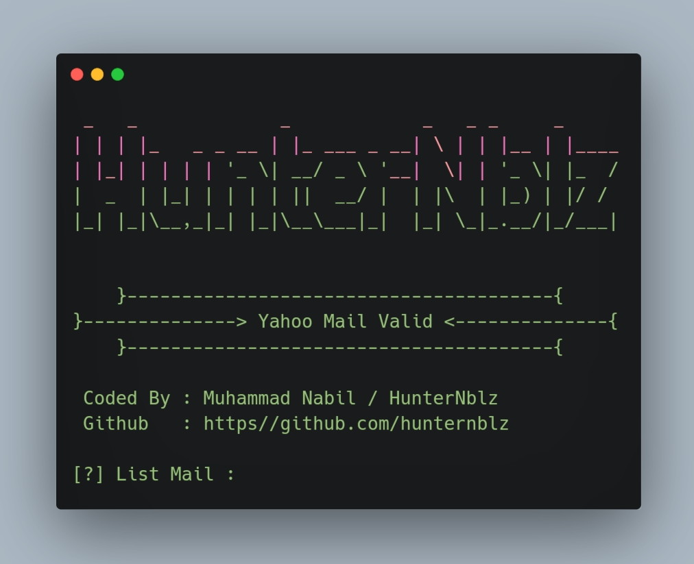

<H1 align="center">
Yahoo Checker
</H1>

<p align="center">
  <a><br> SCREENSHOT </br></a>
  <br>
  
</p>

## Installation + Usage

```terminal
$ git clone https://github.com/hunternblz/Yahoo-Checker.git
$ cd Yahoo-Checker
$ php Yahoo.php
```

# Note
- Live : Email Registered
- Die : Unregistered Email
